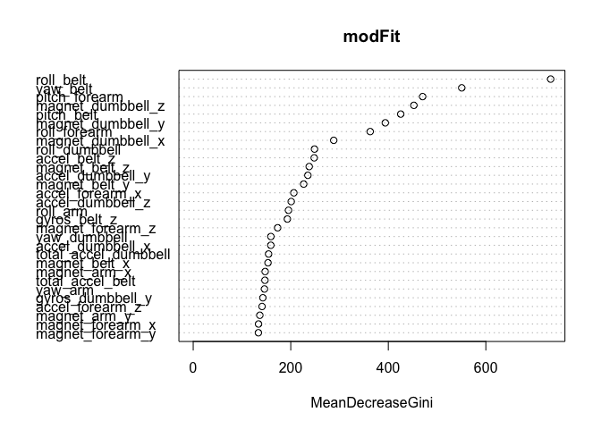

# Practical Machine Learning Course Project
###Introduction
This project for the Practical Machine Learning course of the JHU Data Science specialization calls for the development of a model to classify the quality of individuals perform a certain exercise based on the data collected from activity monitors worn on the individuals' bodies.  The source of this data is the Human Activity Recognition Project at this website: http://groupware.les.inf.puc-rio.br/har (see the section on the Weight Lifting Exercise Dataset).
 
###Getting and Cleaning the Data
The first step is to get and load the data.

```r
library(caret, quietly = TRUE)
library(randomForest, quietly = TRUE)
library(knitr, quietly = TRUE)
 
#Get the training and testing data files
homedir <- getwd()
trainURL <- 'https://d396qusza40orc.cloudfront.net/predmachlearn/pml-training.csv'
testURL <- 'https://d396qusza40orc.cloudfront.net/predmachlearn/pml-testing.csv'
trainfile <- paste0(homedir, '/pml-training.csv')
testfile <- paste0(homedir, '/pml-testing.csv')
#download.file(trainURL, destfile = trainfile, method = 'curl')
#download.file(testURL, destfile = testfile, method = 'curl')
 
#Load the training and testing data
train <- read.csv(file = trainfile)
test <- read.csv(file = testfile)
```
 
Next, we clean the data.  The first step in cleaning the data is to remove the variables that have very little variability using caret's nearZeroVar() function.

```r
cleantrain <- train[,-nearZeroVar(train)]
```
 
In subsequent exploration of the data, two characteristics stand out.  First, there are many columns (variables) that are mostly empty or have lots of NAs.  Many of these columns contain aggregate variables anyway.  Second, the first six columns contain information specific to how the study authors collected the data, specifically the individual subject's name and several columns with when the data was collected.  Keeping these columns would have an unwanted influence on the ability of the model to make predictions on data collected outside of this study.   

```r
#Remove variables that have a significant (at least 5000) number of NAs
cleantrain <- cleantrain[, which(as.numeric(colSums(is.na(cleantrain))) < 5000)]
 
#Then remove the X variable as it is just an index column and remove the username and timestamps
cleantrain <- cleantrain[,-c(1:6)]
```
 
Our training data set has been reduced from 160 variables to 53 variables.
 
###Building the Prediction Model
Given that this is a classification problem, we select Random Forest as the first algorithm to build the prediction model from. 
 
We also plan to use cross-validation to build and test the model.  Using the cleaned training data set of 19622 observations, we start with using 10% of those observations as the initial training set and the remaining 90% as the test set, wanting to minimize the time and memory needed to create the initial random forest model.  Iteratively, we increased the training set percentage from 10% up to the final amount of 60%, following the guideline for using 60% of the cleaned data as the training set and 40% as the testing set.
 
At each stage of the process, testing the model showed that model accuracy was more than 99%.  Because of this high degree of accuracy, we decided not to create another model based on a different class of algorithms, e.g. Decision Trees.
 
Below are the steps for building the final model based on 60% of the cleaned data observations being randomly assigned to the training set and the remaining 40% going to the testing set.

```r
#Set the seed for creating a data partition in the now cleaned training data
set.seed(12345)
 
#Partition the cleantrain data into a training set (mytrain) and a testing set (mytest)
inTrain <- createDataPartition(y = cleantrain$classe, p = 0.6, list = FALSE)
mytrain <- cleantrain[inTrain,]
mytest <- cleantrain[-inTrain,]
```
 
Now, we build the random forest and plot which variables are most important.  The variable 'classe' is the outcome variable, while the remaining variables are all predictors.  Because performance was adequate in building the model, none of the predictors were removed from the model.

```r
#Fit a model using randomForest
modFit <- randomForest(classe ~ ., data = mytrain)
varImpPlot(modFit)
```

 
 
Prior to removing the index, username, and timestamps from the cleaned data set, those variables represented the most important variables.  Now, as the plot above shows, the most important variables are measurements from the activity monitors.
 
Using the model to predict the outcome of the training set resulted in a 100% accuracy, which is expected and shown in the confusionMatrix output.

```r
predictTrain <- predict(modFit, mytrain)
confusionMatrix(predictTrain, mytrain$classe)
```

```
## Confusion Matrix and Statistics
## 
##           Reference
## Prediction    A    B    C    D    E
##          A 3348    0    0    0    0
##          B    0 2279    0    0    0
##          C    0    0 2054    0    0
##          D    0    0    0 1930    0
##          E    0    0    0    0 2165
## 
## Overall Statistics
##                                 
##                Accuracy : 1     
##                  95% CI : (1, 1)
##     No Information Rate : 0.284 
##     P-Value [Acc > NIR] : <2e-16
##                                 
##                   Kappa : 1     
##  Mcnemar's Test P-Value : NA    
## 
## Statistics by Class:
## 
##                      Class: A Class: B Class: C Class: D Class: E
## Sensitivity             1.000    1.000    1.000    1.000    1.000
## Specificity             1.000    1.000    1.000    1.000    1.000
## Pos Pred Value          1.000    1.000    1.000    1.000    1.000
## Neg Pred Value          1.000    1.000    1.000    1.000    1.000
## Prevalence              0.284    0.194    0.174    0.164    0.184
## Detection Rate          0.284    0.194    0.174    0.164    0.184
## Detection Prevalence    0.284    0.194    0.174    0.164    0.184
## Balanced Accuracy       1.000    1.000    1.000    1.000    1.000
```
 
Next, we use the model to predict the outcome for the testing set.  As shown in the confusion matrix output, the accuracy is 99.4%, which means that the out of sample error of this model alone is (1-accuracy) or 0.6%.

```r
#Test the model
predictTest <- predict(modFit, mytest)
confusionMatrix(predictTest, mytest$classe)
```

```
## Confusion Matrix and Statistics
## 
##           Reference
## Prediction    A    B    C    D    E
##          A 2230    8    0    0    0
##          B    2 1506    4    0    0
##          C    0    4 1364   15    3
##          D    0    0    0 1269    6
##          E    0    0    0    2 1433
## 
## Overall Statistics
##                                         
##                Accuracy : 0.994         
##                  95% CI : (0.992, 0.996)
##     No Information Rate : 0.284         
##     P-Value [Acc > NIR] : <2e-16        
##                                         
##                   Kappa : 0.993         
##  Mcnemar's Test P-Value : NA            
## 
## Statistics by Class:
## 
##                      Class: A Class: B Class: C Class: D Class: E
## Sensitivity             0.999    0.992    0.997    0.987    0.994
## Specificity             0.999    0.999    0.997    0.999    1.000
## Pos Pred Value          0.996    0.996    0.984    0.995    0.999
## Neg Pred Value          1.000    0.998    0.999    0.997    0.999
## Prevalence              0.284    0.193    0.174    0.164    0.184
## Detection Rate          0.284    0.192    0.174    0.162    0.183
## Detection Prevalence    0.285    0.193    0.177    0.163    0.183
## Balanced Accuracy       0.999    0.996    0.997    0.993    0.997
```

However, because it took several iterations to reach this model where all of the cleaned data was used with cross validation, we need to average the out-of-sample error rates for all models to get a true estimate of the out-of-sample error rate.  

Below is a table the contains the proportion of the data used in the training set, which is designated as 'p',  and the corresponding estimated out-of-sample error rate.


|   p| out-of-sample error|
|---:|-------------------:|
| 0.1|              0.0464|
| 0.2|              0.0308|
| 0.4|              0.0134|
| 0.5|              0.0085|
| 0.6|              0.0056|

Therefore, taking the average of those error rates, the true out-of-sample error rate, that takes cross validation into account, is 2.094%.

###Conclusion
It was quickly evident that a Random Forest prediction model for this project was extremely accurate.  Using 60% of the training data with only variables based on raw data from activity monitors resulted in a prediction model with 2.094% out of sample error based on cross validation.  Even better, when run to predict the final 20 different test cases, it predicted all 20 correctly.
 
###Reference
Velloso, E.; Bulling, A.; Gellersen, H.; Ugulino, W.; Fuks, H. Qualitative Activity Recognition of Weight Lifting Exercises. Proceedings of 4th International Conference in Cooperation with SIGCHI (Augmented Human '13) . Stuttgart, Germany: ACM SIGCHI, 2013.
